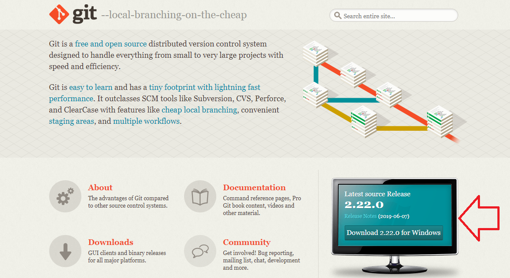
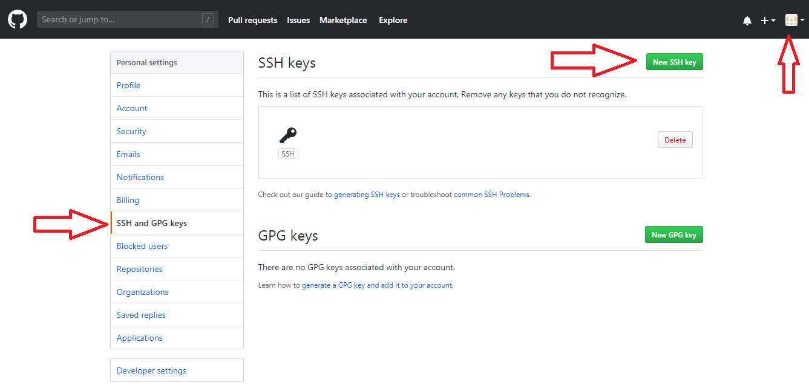

# INSTRUCTIVO PARA TRABAJAR CON GITHUB

- [INSTRUCTIVO PARA TRABAJAR CON GITHUB](#INSTRUCTIVO-PARA-TRABAJAR-CON-GITHUB)
  - [Instalación de git en tu local](#Instalaci%C3%B3n-de-git-en-tu-local)
  - [Configuración inicial](#Configuraci%C3%B3n-inicial)
    - [Configuración de usuario](#Configuraci%C3%B3n-de-usuario)
    - [Configuración de llave (Pública y privada)](#Configuraci%C3%B3n-de-llave-P%C3%BAblica-y-privada)
    - [CARGAR UN ARCHIVO A GIT](#CARGAR-UN-ARCHIVO-A-GIT)

## Instalación de git en tu local

Como primer paso, es necesario hacer la descarga del software **git SCM*. A continuación el link de descarga [Git SCM download link](https://git-scm.com/ "Git SCM download link"). De esta página se descarga presionando en la pantalla, como lo muestra la siguiente imagen.

Se ejecuta el **.exe** y se hace la instalación del git en el ordenador.Para trabajar Github de un ordenador propio con Github cloud, se necesita crear una cuenta en Github. A continuación link [Acceso al web site Github](https://github.com/ "Acceso al web site Github").

  
## Configuración inicial

Una vez creada una cuenta, se necesita hacer las primeras configuraciones para comunicar un local con la web y poder subir repositorios, trabajar en conjunto en interactuar propiamente con Github. Para ello se siguen los siguientes pasos.

### Configuración de usuario

Lo primero es dar de alta la identidad. Para poder interactuar con Githup se necesita un nombre de usuario y un correo. Los códigos necesarios para ello son los mostrados a continuación. 

~~~bash
   git config --global user.name "Nombre de usuario"
   git config --global user.email micorreo@gmail.com
~~~  

Puedes verificar tus datos con el comando:

~~~bash
    git config --list
~~~

Una vez ejecutado el comando se puede corroborar tu nombre de usuario y correo.

### Configuración de llave (Pública y privada)

Lo siguiente es generar una llave que será guardada en una ruta específica de usuarios, en el discol local C. Se usará el siguiente comando:
  
~~~ bash
ssh-keygen -o -t rsa -b 4096 -C "micorreo@gmail.com"
~~~

Cuando se ha generado la llave, el mismo comando despliega la dirección donde se ha alojado esa llave. Con frecuencia es:

~~~ bash
/c/Users/usuario1/.ssh/id_rsa
~~~

Y ahora desde el bash se abre el contenido de la llave que se acaba de generar

~~~bash
cat /c/Users/usuario1/.ssh/id_rsa.pub
~~~

Se muestra una cadena de caracteres que es la llave pública que se copiará al Githup en la web. Se necesita comenzar la sesión en Git y acceder a los siguientes secciones.
Primero clickear en la pestaña superior derecha, esta despliega la opción de *settings*, al acceder ahí entrar a *SSH and GPG keys* y seleccionar *New SSH key*. Este proceso se detalla en la siguiente imagen.

### CARGAR UN ARCHIVO A GIT

Se sigue también una metodología cargar un repositorio, una carpeta con códigos, imagenes, texto y demás; con la ayuda de los siguiente pasos.

1. Una vez seleccionada la capeta que será el repositorio de git, "hp-printer-wifi-config", teclear el comando siguiente. Este comando lo que hace es crear un repositorio vacio en tu Git web.

    ~~~bash
    git init
    ~~~

2. Subir un apartdo, *remote*, que conectará la pc local con el github. Este apartado contiene dos partes, el nombre del apartado y el URL.

     ~~~ bash
      git remote add origin https://github.com/user/repo.git
    ~~~
    
  Dentro de esta parte en git se subirán los archivos, carpetas y documentos que están en el repositorio de mi local.

3. Puede conocerce el estado del documento que acaba de subirse con:

    ~~~ bash
      git status
      ~~~

    Para este caso, se muestra que aun no tiene "commits". Puede observarse que el archibo **README.md** se muestra en color rojo.

4. Por el detalle anterior, la falta de *commits*, se usará el siguiente comando que hace la preparación para agregar los commits. Este es:

    ~~~ bash
      git add -A
    ~~~
  
6. Este paso queda comprobado con el uso del siguiente comando `git status` donde se muestra el README.md en color *verde*. Esto indica que está preparado para ser cargado.

7. Como se mencionó anteriormente, hace falta agregar los "commits", para esto se usa el comando.

    ~~~ bash
    git commit -m
    ~~~

    Y entre comillas se agregan los comentarios que aparecerán en el encabezado "Este es el primer commit con los archivos iniciales".

8. Puede observare los cambios que se están haciendo al repositorio de git con un comando similar al *git status* que es:

   ~~~ bash
   git log
   ~~~

9. Ya hechos los pasos previos, se cargan los remotos que ya se prepararon

    ~~~ bash
    git remote add origin https://github.com/user/repo.git
    ~~~

10. Y finalmente se carga todo el repositorio con:

    ~~~ bash
    git push -u origin master
    ~~~

11. Cuando solo se hacen actualizaciones dentro de la misma rama se utiliza el comando ``git push`` sin nada más.
